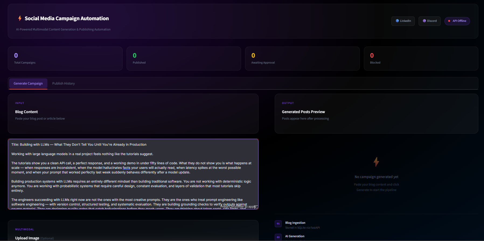
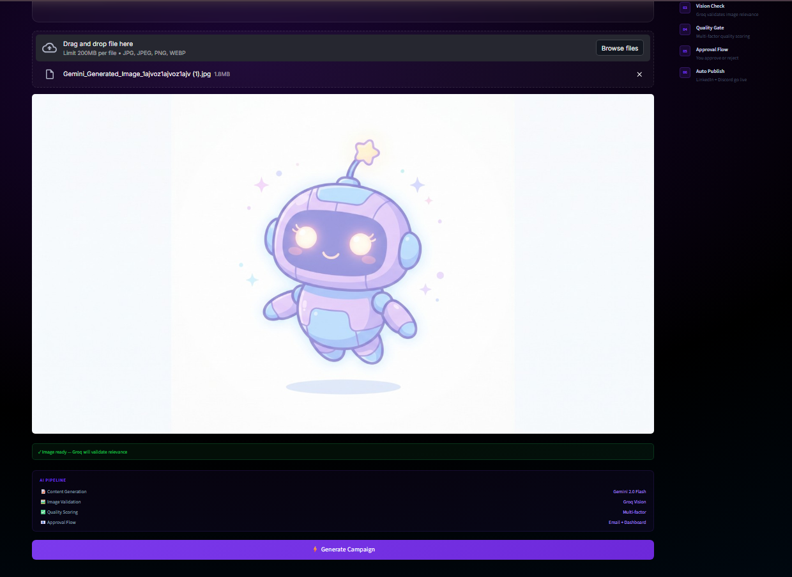

# ⚡ AI-Powered Multimodal Social Media Campaign Automation

> **Transform one blog post into validated, platform-specific social media content — automatically generated, AI-validated, human-approved, and published.**

An end-to-end AI automation system that transforms a single blog post into platform-specific content for **LinkedIn and Discord**.

The system combines **Generative AI, RAG, multimodal AI, LLM-based quality evaluation, human-in-the-loop approval, and n8n workflow automation** to create a controlled content generation and publishing pipeline.

**Built as a Capstone Project during my AI Engineering Internship at FlyRank AI.**

---

## 🚀 What It Does

Instead of manually creating, reviewing, approving, and publishing content for each platform, the system automates the complete workflow.

**Input:**

* Blog content
* Optional campaign image

**Output:**

* Platform-specific LinkedIn and Discord content
* AI validation and quality scores
* Human approval request
* Automated publishing
* Campaign history

### End-to-End Flow

```text
Blog + Optional Image
        ↓
Streamlit UI
        ↓
FastAPI Backend
        ↓
n8n Workflow
        ↓
RAG + Brand Memory
        ↓
AI Content Generation
        ↓
Multimodal Image Validation
        ↓
Grounding & Quality Check
        ↓
PASS / REVIEW / BLOCK
        ↓
Human Approval via Gmail
        ↓
LinkedIn + Discord Publishing
        ↓
Campaign History
```

---

## ✨ Key Features

### 🧠 RAG-Based Brand Memory

Uses **LangChain and ChromaDB** to retrieve relevant brand context before content generation, helping maintain a consistent tone and style.

### ✍️ Platform-Specific Content Generation

Generates separate content for **LinkedIn and Discord** instead of reusing identical content across platforms.

### 🖼️ Multimodal AI Validation

When an image is uploaded, **Qwen3.6-27B via Groq** evaluates the image against the blog content for:

* Image-blog relevance
* Relevance score
* Image quality
* Safety
* Reasoning

### 🔍 Grounding & Quality Gate

**GPT-OSS-20B via Groq** evaluates generated content against the original blog for grounding, claims consistency, and overall quality.

Each campaign receives one of three statuses:

`PASS` · `REVIEW` · `BLOCK`

### 👤 Human-in-the-Loop Approval

Generated campaigns are sent through **Gmail** for explicit human approval before publishing.

### 🚀 Automated Publishing

Approved campaigns are automatically published to:

* LinkedIn
* Discord

### 📊 Campaign Tracking

Campaign data, generated content, evaluation scores, statuses, and publishing results are stored using **SQLite**.

---

## 🖼️ Project Output

### 🔄 End-to-End n8n Automation Workflow

The complete workflow orchestrates blog ingestion, RAG retrieval, AI generation, multimodal validation, quality evaluation, human approval, and automated publishing.

<p align="center">
  
</p>

### 🖥️ Streamlit Dashboard

The Streamlit interface provides a centralized dashboard for submitting blog content and optionally uploading campaign images.

|                               Campaign Generation                              |                                                Image Upload                                                |
| :----------------------------------------------------------------------------: | :--------------------------------------------------------------------------------------------------------: |
|     |  |
| **Campaign dashboard** — Submit blog content and start the automated workflow. |             **Multimodal input** — Upload an optional campaign image for AI-powered validation.            |

---

## 🏗️ Architecture

```text
                 ┌──────────────────┐
                 │   Streamlit UI   │
                 │ Blog + Image     │
                 └────────┬─────────┘
                          ↓
                 ┌──────────────────┐
                 │ FastAPI Backend  │
                 │ APIs + Storage   │
                 └────────┬─────────┘
                          ↓
                 ┌──────────────────┐
                 │ n8n Orchestrator │
                 └────────┬─────────┘
                          ↓
          ┌───────────────┼────────────────┐
          ↓               ↓                ↓
      ChromaDB         Gemini            Groq
       RAG           Generation       Validation
          │               │                │
          └───────────────┼────────────────┘
                          ↓
                 Grounding & Quality
                        Gate
                          ↓
                  Gmail Approval
                          ↓
                 ┌────────┴────────┐
                 ↓                 ↓
             LinkedIn           Discord
```

---

## 🤖 AI Models

| Model                       | Role                                 |
| --------------------------- | ------------------------------------ |
| **Google Gemini 3.7 Flash** | Platform-specific content generation |
| **Qwen3.6-27B via Groq**    | Multimodal image-blog validation     |
| **GPT-OSS-20B via Groq**    | Grounding and quality evaluation     |

---

## 🛠️ Tech Stack

**AI & RAG:**
Gemini 3.7 Flash · Qwen3.6-27B · GPT-OSS-20B · LangChain · ChromaDB · RAG

**Backend & UI:**
Python · FastAPI · Streamlit · SQLite

**Automation & Integrations:**
n8n · Gmail · LinkedIn API · Discord Webhooks

---

## 📁 Project Structure

```text
AI-Powered-Multimodal-Social-Media-Campaign-Automation/
│
├── README.md
├── app.py
├── api_server.py
├── n8n_workflow.json
│
├── Workflow_Output (2).png
├── Social_Media_UI.png
└── Social_Media_UI_image_upload.png
```

* **`app.py`** — Streamlit dashboard
* **`api_server.py`** — FastAPI backend and REST APIs
* **`n8n_workflow.json`** — Complete n8n automation workflow

---

## 🔐 Security

API keys, access tokens, and webhook credentials should **never be committed to a public repository**.

Use environment variables or secure n8n credentials for configuration.

---

## 👩‍💻 Built By

**Waariha Asim Sheikh**

AI Engineer | Generative AI | AI Automation | Backend Development

**Capstone Project — FlyRank AI Engineering Internship**
